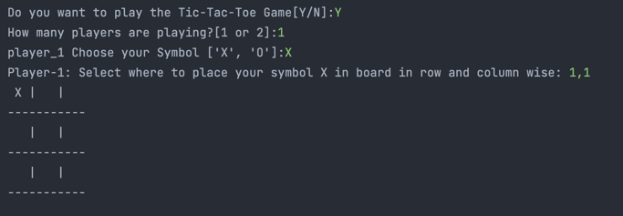
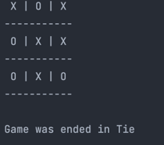

# Tic-Tac-Toe

It is text-based version of the Tic Tac Toe game. 

Use this [Replit Link](https://replit.com/@Krishnakumarv1/Tic-Tac-Toe#main.py) to test this Game.

## What is Tic-Tac-Toe?
Tic-tac-toe, noughts and crosses, or Xs and Os is a paper-and-pencil game for two players who take turns marking the spaces in a three-by-three grid with X or O. The player who succeeds in placing three of their marks in a horizontal, vertical, or diagonal row is the winner.

### Sample-Image
1. Basic Game Overview (Image-1)

2. Sample Overview Final result (Image-2)

